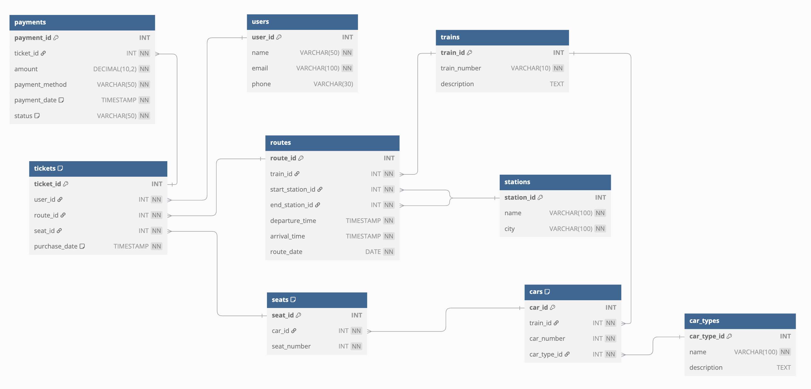

# Проект: База данных для системы управления поездами и маршрутами

## Описание
Данный проект демонстрирует опыт проектирования и реализации реляционной базы данных, моделирующей информацию о поездах, маршрутах и связанных сущностях. 

## Технологии и инструменты
- **DBDiagram.io** — для концептуального проектирования ER-диаграмм.
- **pgAdmin4** — для разработки, тестирования и управления базой данных PostgreSQL.
- **SQL** — для создания структуры базы, определения ограничений, индексов, представлений и триггеров.

## Структура базы данных
```
users ───────┬──────────── tickets ───────┬────── payments
             │                           │
             │                           ├────── seats ───── cars ───── car_types
             │                           │                        │
             │                           └────── routes ──────── trains
             │                                           │
             └────────────────────────────────────────── stations
```


## Что было сделано
- **Концептуальное проектирование**  
  Созданы ER-диаграммы с определением ключевых сущностей и связей между ними.

- **Логическое проектирование**  
  Построена модель данных, независимая от СУБД, с детальным описанием первичных и внешних ключей.

- **Физическое проектирование**  
  Выбран тип данных, создана структура таблиц, индексирование для повышения производительности.

- **Реализация базы данных**  
  Написан SQL-код для создания базы, включая таблицы, ограничения целостности, связи, индексы, представления и триггеры.

## Как использовать
- В проекте присутствует дамп базы данных в формате SQL (`db_dump.sql`), который можно восстановить в PostgreSQL с помощью:

  ```bash
  psql -U postgres -d <railway-database> -f db_dump.sql
